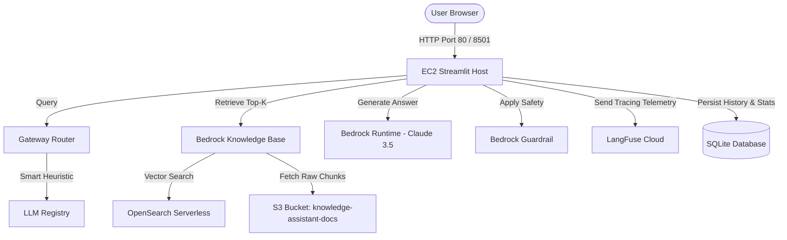

# System Architecture & Technical Specification

## 1. System Overview

---

## 2. Core Components

### A. Presentation Layer (Streamlit Frontend)
- **Dashboard (`app/main.py`)**: Displays active system metrics, Knowledge Base ID, Guardrail status, and feature cards.
- **Chat Interface (`app/pages/01_chat.py`)**: Supports text input, microphone voice input, image attachments, and per-message token/cost metrics.
- **Analytics Interface (`app/pages/02_analytics.py`)**: Renders interactive Plotly charts showing cost trends, token consumption, and model breakdown.

### B. Gateway & Routing Layer
- **Router (`gateway/router.py`)**: Evaluates query complexity based on word count and keyword heuristics (`_COMPLEX_PATTERNS` / `_SIMPLE_PATTERNS`).
- **Registry (`gateway/llm_registry.py`)**: Centralized model metadata repository defining token costs, supported tiers, and capabilities.

### C. Knowledge & Retrieval Layer
- **Amazon Bedrock Knowledge Base (`NOGI8O0Q8R`)**: Performs vector retrieval using Amazon Titan Embeddings Text v2.
- **OpenSearch Serverless Vector Store**: Indexes chunked documents using k-NN vector search.

### D. Safety & Observability
- **Amazon Bedrock Guardrail (`a073v02w8c2x`)**: Enforces PII redaction and blocks off-topic/competitor queries.
- **LangFuse Tracer (`observability/langfuse_tracer.py`)**: Transmits spans and telemetry to `https://us.cloud.langfuse.com`.
