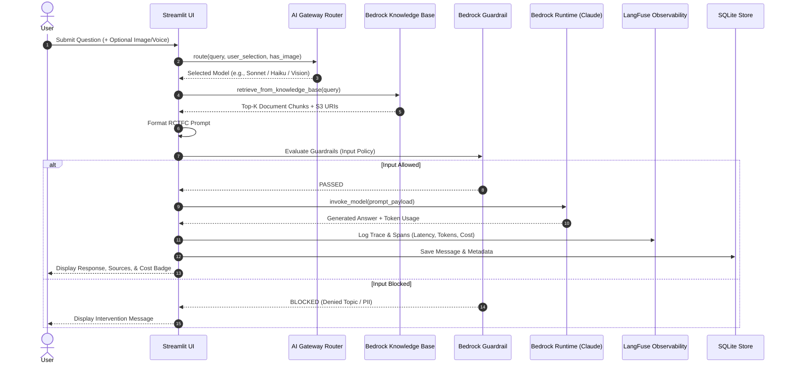
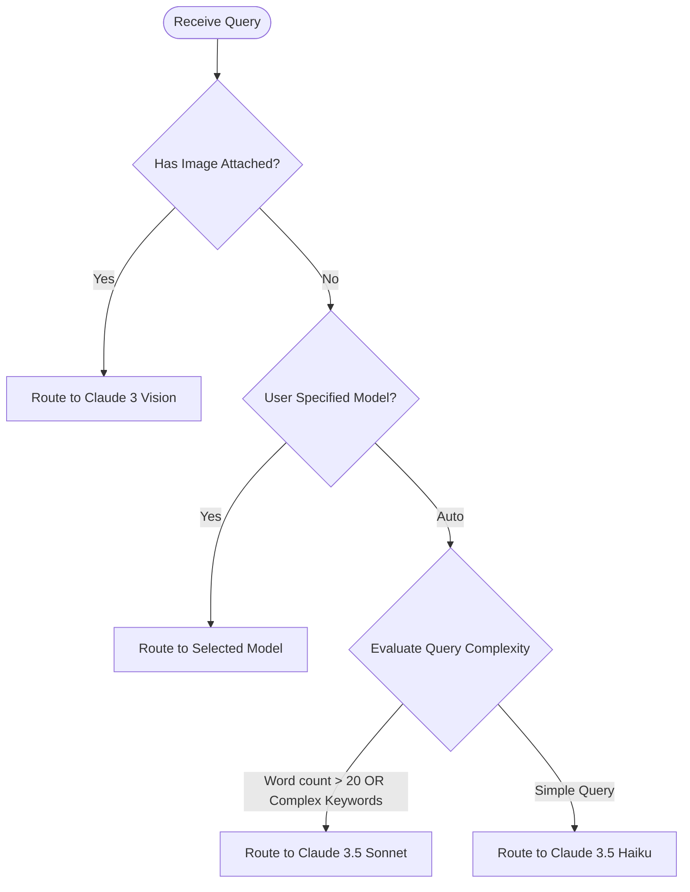

# System Sequence & Workflow Diagrams

## 1. End-to-End RAG Query Sequence

```mermaid
sequenceDiagram
    autonumber
    actor User
    participant UI as Streamlit UI
    participant Router as AI Gateway Router
    participant KB as Bedrock Knowledge Base
    participant Guard as Bedrock Guardrail
    participant LLM as Bedrock Runtime (Claude)
    participant LF as LangFuse Observability
    participant DB as SQLite Store

    User->>UI: Submit Question (+ Optional Image/Voice)
    UI->>Router: route(query, user_selection, has_image)
    Router-->>UI: Selected Model (e.g., Sonnet / Haiku / Vision)
    UI->>KB: retrieve_from_knowledge_base(query)
    KB-->>UI: Top-K Document Chunks + S3 URIs
    UI->>UI: Format RCTFC Prompt
    UI->>Guard: Evaluate Guardrails (Input Policy)
    alt Input Allowed
        Guard-->>UI: PASSED
        UI->>LLM: invoke_model(prompt_payload)
        LLM-->>UI: Generated Answer + Token Usage
        UI->>LF: Log Trace & Spans (Latency, Tokens, Cost)
        UI->>DB: Save Message & Metadata
        UI-->>User: Display Response, Sources, & Cost Badge
    else Input Blocked
        Guard-->>UI: BLOCKED (Denied Topic / PII)
        UI-->>User: Display Intervention Message
    end
```

---

## 2. AI Gateway Routing Logic

```mermaid
flowchart TD
    Start([Receive Query]) --> CheckImage{Has Image Attached?}
    CheckImage -- Yes --> Vision[Route to Claude 3 Vision]
    CheckImage -- No --> CheckOverride{User Specified Model?}
    CheckOverride -- Yes --> Override[Route to Selected Model]
    CheckOverride -- Auto --> ComplexityCheck{Evaluate Query Complexity}
    ComplexityCheck -- Word count > 20 OR Complex Keywords --> Sonnet[Route to Claude 3.5 Sonnet]
    ComplexityCheck -- Simple Query --> Haiku[Route to Claude 3.5 Haiku]
```
